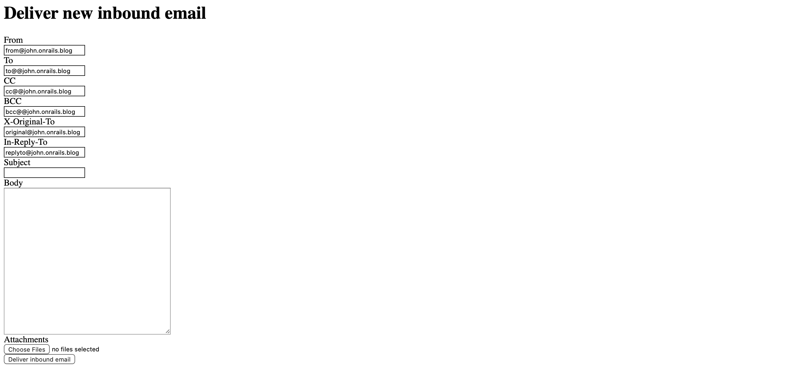
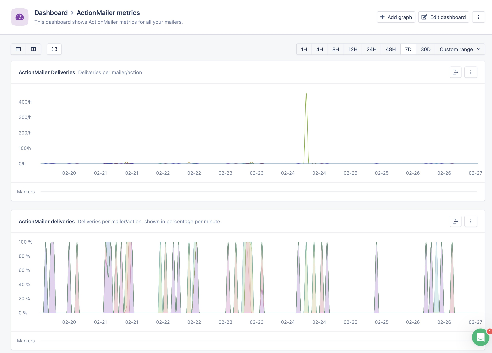

# Integrating and Troubleshooting Inbound Emails in Rails

If you’ve ever looked at the RFCs around [sending and receiving emails](https://www.rfc-editor.org/rfc/rfc5321), you’ll see the technical complications in hitting send in your email inbox. Thankfully, there are many existing tools that provide the SMTP service for us developers, from a postfix server you manage, to a fully scalable sending service like Sendgrid, Amazon SES, Postmark, or many others. The benefit of multiple providers means moving between providers for deliverability or pricing reasons would mean rewriting or refactoring our apps to meet the peculiarities of each service. Rails helps us again by providing ActionMailbox. ActionMailbox is conceptual compression for receiving email in Ruby on Rails, encapsulating the small differences between each service, even allowing you to write a provider for a new service, and writing your inbound processing code once.

## What is ActionMailbox?

The key concept of ActionMailbox is the routing based on the recipients of the email. Setting up an inbound email provider means that mail going to a domain will be routed into your app, and you can look at the recipient address to determine how each mail message should be processed.


If you go through the rails conductor action to send a test email, like I have in the screenshot, your inbound email would have recipients from the `To`, `CC`, `BCC` and `X-Original-To` fields. 
```ruby
> inbound_email = ActionMailbox::InboundEmail.last
> inbound_email.mail.recipients 
["to@john.onrails.blog", "cc@john.onrails.blog", "bcc@john.onrails.blog", "original@john.onrails.blog"]
```
Each one of those addresses will be tested, in order, to determine where it will be routed, but the mail message will only be routed once.

One key aspect of development is actually testing email from your system. Rails has a set of development pages under the routes `/rails/conductor/` that allows you to input emails locally into your development setup. You can enter the email manually, like I did in the earlier example, or you can upload an email complete will all the headers. I’ve found a great way to get a complete email, with headers, message body, and attachments, is to use an email client like Thunderbird, save the individual email in a `.eml`, open the file with a text editor, and copy the complete contents into the conductor page. Now, you could test more complicated email processing.

## Posting and Commenting demo

Let’s try putting together a small demo to show how this all works. I’m a great admirer of 37Signals, and I especially like their attempt at blogging with Hey World. But they don’t have comments, so let’s create a clone that has comments for each blog post.

Create a new app (I’m using Tailwind for the CSS, but you can pick what makes sense). I’ll also add ActionText for the post, and the Post and Comment models.
```bash
$ rails new BlogWorld -c tailwind
$ cd BlogWorld
$ bin/rails action_text:install
$ rails g scaffold Post title:string author:string content:rich_text
$ rails g scaffold Comment author:string content:rich_text post:references
```

The scaffolding will give us a quick way to see the Posts and Comments. Let’s have the post display any related comments by adding the association in `post.rb`:
```ruby
class Post < ApplicationRecord
  has_many :comments
  has_rich_text :content
end
```

And in `posts/_post.html.erb`, let's add the comments partial:
```eruby
<div class="ml-12 pl-4 my-4 border-l-2 border-green-500">
  <%= render post.comments %>
</div>
```

We now have a sparse post and comment view. Set up the inbound email for posting to the blog:
```bash
$ bin/rails action_mailbox:install
$ bin/rails g mailbox Post
```

This will generate the `ApplicationMailbox` where we’ll set up a route for anything to `blog@` to go to our Post mailbox, and create a post.
```ruby
class ApplicationMailbox < ActionMailbox::Base
  routing /blog@/i => :post
end
```

You can test this quickly by going to [http://localhost:3000/rails/conductor/action\_mailbox/inbound\_emails](http://localhost:3000/rails/conductor/action_mailbox/inbound_emails) and sending some emails to your service. If you send something to `blog@whatever.com`, You should see the email is delivered, meaning it was delivered to an inbox on our app. If you email any other address, you should see the message bounced. 

Let’s set up the Post Mailbox to receive the email, post it to the blog. Each Mailbox has access to the original `inbound_email` object, and the `mail` object. The InboundEmail is a wrapper around the [mail](http://github.com/mikel/mail) class used throughout rails. For our purposes, we’re interested in whom the email is from, the subject, and the body of the email. We can extract them and create a Post record that will show up on the front page of our blog.
```ruby
class PostMailbox < ApplicationMailbox
  def process
    Post.create title: mail['subject'].to_s, author: mail['from'].to_s, content: mail.body.to_s
  end
end
```

Go ahead, and send another email to your blog address, and then refresh the index page. You should see the post!

Now, to add comments for a Post. First, any email commenter is going to need to refer to the correct Post when sending an email. A simple way would be to encode the ID of the Post in the inbound email address, like `comment+123@whatever.com`, where the 123 in the email address refers to a Post element. Generate the `CommentMailbox`:
```bash
$ bin/rails g mailbox Comment
```
Add a route in ActionMailbox to send any emails with `comment+123` to the `CommentMailbox`:
```ruby
  routing /^comment\+\d+@/i => :comment
```

In the `_post.html.erb`, add a link to generate the email address, so someone can open their email app and send an email:
```eruby
  <div class="ml-12 pl-4 my-4 border-l-2 border-green-500">
    <%= render post.comments %>
    <%= mail_to "comment+#{post.id}@whatever.com", class: "rounded-lg py-3 px-5 bg-gray-100 inline-block font-medium" %>
  </div>
```
The incoming email will get routed to the `CommentMailbox`, where the parsing of the email into a comment attached to the correct blog post occurs.
```ruby
class CommentMailbox < ApplicationMailbox
  def process
    Comment.create author: mail["from"].to_s, content: mail.body.to_s, post: post
  end

  def post
    return @post unless @post.nil?
    email = mail.recipients.reject { |address| address.blank? }.first
    match = email.match(/^comment\+(.*)@/i)
    token = match[1]

    begin
      if token
        @post = Post.find_by_id(token)
      else
        bounced!
      end
    rescue RecordNotFound
      bounced!
    end
  end
end
```
The `process` method creates a comment from the email body, and the sender email. It references the `Post` which is queried in the `post` method. This method gets the first recipient email address, and uses a regular expression to pull out the post id. If the Post doesn’t exist, or a token can’t be parsed, the email is bounced, which stops processing. 
If you go to the Rails conductor form, and send a comment to the address for each Post, the comment will appear underneath the Post on the index page!

## Too Easy?
Emails are actually really complicated. Imagine you deployed something like this to your app, and you start seeing errors in your AppSignal dashboard. You may see something error parsing, or the posts or comments have a lot of weird formatting errors. 
Your app is receiving HTML emails, and we’re taking the raw body source and posting it to the website. The mail gem gives us the ability to see if the incoming email has an HTML body, and we can pull whatever parts from the message we need. Let’s change the `CommentMailbox` and `PostMailbox` to check for multipart emails, and pull out the HTML part, falling back to text if that’s all that’s left.

Each email either has no parts or multiple parts, and the preferred order would be to see if there is an HTML part, use it, if not, try to get the text part, and use it. If there aren’t parsed HTML or text sections, we’ll use the email body as before. The PostMailbox now is a little more complicated:
```ruby
class PostMailbox < ApplicationMailbox
  def process
    post = Post.new title: mail["subject"].to_s, author: mail["from"].to_s
    post.content = if mail.html_part
      mail.html_part.decoded
    elsif mail.text_part
      mail.text_part.decoded
    else
      mail.decoded
    end
    post.save
  end
end 
```
The `CommentMailbox` also has a different process method:
```ruby
  def process
    comment = Comment.new author: mail["from"].to_s, post: post
    comment.content = if mail.html_part
      mail.html_part.decoded
    elsif mail.text_part
      mail.text_part.decoded
    else
      mail.decoded
    end
    comment.save
  end
```
Now, we can handle emails that would come from someone’s phone.

## Adding ActionMailbox to your app
ActionMailbox allows us to consider emails to be another I/O avenue for our app. By using Conceptual Compression, we can write code independent of the email service provider. I’ve even been able to move email providers with a minimal amount of work, since I don’t have to worry about the underlying infrastructure.
AppSignal also provides a convenient dashboard that lets you monitor all your outgoing ActionMailers, so you can keep an eye on deliverability. Here’s one of my apps that sends and receives lots of email:

Now you’ll have more visibility into what’s going on inside your app.


## Code
You can find the code for this post at [https://github.com/OnRailsBlog/BlogWorld](https://github.com/OnRailsBlog/BlogWorld)
